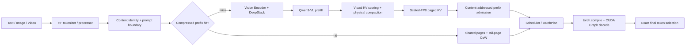

# Prism-Infer

面向 **Qwen3-VL** 的压缩感知多模态推理引擎。

Prism-Infer 关注三个相互关联的问题：如何把 `torch.compile` 与 CUDA Graph
真正接入有状态 decode，如何降低视觉上下文的 KV Cache 成本，以及如何在重复媒体
负载中安全复用已经压缩的多模态前缀。项目以 nano-vllm 的轻量运行时结构为起点，
逐步实现了 Qwen3-VL text/vision forward、M-RoPE、DeepStack、Paged KV、
continuous batching、原生 HTTP/SSE 服务与面向 SLO 的调度路径。

这不是 vLLM/SGLang 的功能复刻，也不声称在所有场景全面领先。项目的核心价值是：
围绕一个真实多模态模型，完成从 profiler 归因、kernel/Graph 优化、KV 表示设计，
到在线 workload 取舍的完整推理优化闭环。

## 项目亮点

- **Compiler + Graph decode**：将无状态 decode 子图交给 `torch.compile`，
  再由固定 batch bucket 的 CUDA Graph 捕获完整 decode replay；KV 页表、slot
  mapping 与 scale cache 仍由运行时显式管理。
- **真实 Qwen3-VL TP2**：语言模型 QKV、MLP、词表与每卡 KV Cache 按 rank 分片，
  row-parallel 路径执行 NCCL 归约；rank-local QKV 子图交给 `torch.compile`，外层
  CUDA Graph 捕获 NCCL 与精确分布式 top-1，并以紧凑状态载荷驱动每步 replay。
- **Scaled-FP8 KV Cache**：K/V 使用 E4M3FN payload，并为每个 token、每个 KV
  head 保存独立 FP32 scale；覆盖写入、paged attention、CoW、swap、物理压实和
  Graph replay 的完整生命周期。
- **视觉 KV 物理压实**：根据解码器注意力保留重要视觉 token，重写物理 KV
  布局并释放空闲页；逻辑 M-RoPE 位置与物理 KV 位置解耦，不只是 attention mask。
- **内容寻址的压缩前缀缓存**：以模型/processor namespace、媒体精确内容与布局、
  截止最后一个视觉占位符的 prompt prefix 构造安全身份，跨请求复用 processor
  结果、Vision/DeepStack 输出和已压实的 scaled-FP8 KV 页。
- **面向真实指标的 serving**：支持 chunked prefill、continuous batching、
  请求生命周期管理与 SLO-aware scheduling；优化目标同时观察 TTFT、TPOT、
  throughput、Goodput、KV 容量和进程显存。

## 核心结果

所有数字均来自 RTX 5090 与 Qwen3-VL-8B-Instruct。KV/serving 主结果采用 TP1；
Decode 同时保留 TP1 H1/H2 与双卡 TP2 外部引擎对比。完整环境、输入和边界见
[结果](docs/RESULTS.md)。

### 1. Offline decode latency

batch1、greedy、output 128、warmup 2 / repeat 5；三引擎使用一致的 prompt token。
下表单位为毫秒，越低越好。

| Case | Prism BF16 | SGLang BF16 | vLLM BF16 | Prism 相对 SGLang | Prism 相对 vLLM |
|---|---:|---:|---:|---:|---:|
| H1：8 张 448×448 图片 | **9.8821** | 10.3520 | 10.5276 | **-4.54%** | **-6.13%** |
| H2：16 帧 448×448 视频 | **9.8680** | 10.3689 | 10.5278 | **-4.83%** | **-6.27%** |

这是受限 offline TPOT 结论，不代表任意 batch、模型或 online workload 的全面排名。

### 2. KV memory and capacity

| KV profile | Token capacity | Allocated KV | NVML process peak |
|---|---:|---:|---:|
| BF16，113 pages | 28,928 | 4,068.000 MiB | 23,938 MiB |
| Scaled-FP8，同容量 | 28,928 | 2,097.562 MiB | 21,966 MiB |
| Scaled-FP8，约 4 GiB budget | 56,320 | 4,083.750 MiB | 23,952 MiB |

同容量下 allocated KV 减少 **48.44%**，进程显存峰值减少 **8.24%**；
同等约 4 GiB KV budget 下 token capacity 提升 **94.69%**。量化节省的是 KV
存储，不是让模型权重或整张 GPU 显存减半。

### 3. Content-addressed multimodal reuse

60 请求、Poisson 4 req/s、output 64；每次请求都重新创建媒体对象，重复只由
byte-identical 内容定义。三套系统都打开各自可用的官方缓存路径。

| 媒体重复率 | Prism raw / Goodput | vLLM raw / Goodput | Prism SLO |
|---:|---:|---:|---:|
| 0% | 216.188 / 133.316 | **223.079 / 215.643** | 37/60 |
| 50% | 217.083 / 206.228 | **223.521 / 219.796** | 57/60 |
| 75% | 224.279 / 224.279 | **225.112 / 225.112** | 60/60 |
| 100% | 224.369 / 224.369 | **225.004 / 225.004** | 60/60 |
| 100%，问题变化 | 224.301 / 224.301 | **225.004 / 225.004** | 60/60 |

高重复率下 Prism 与 vLLM 的 raw throughput 差距缩小到 **0.28%–0.37%**，
应视为近似持平；Prism 的 100% 重复结果比可用的 SGLang cache-on 参考高
**0.82% raw / 4.30% Goodput**。在 0%–50% 重复率下 vLLM 仍明显领先，这说明
Prism 的冷多模态 prefill 仍是下一阶段的主要瓶颈。

600 请求、100% 重复的长程闭环达到 **241.428 tok/s、600/600 SLO**，
TTFT/TPOT p50 为 **146.418/13.041 ms**；同时保持 48.44% KV 存储压缩、
视觉物理页回收和退出显存释放。

### 4. Dual-GPU TP2 decode

TP2 不是只把进程启动在两张卡上：Qwen3-VL 语言权重、KV heads 与词表按 rank
分片，rank-local `torch.compile` 不跨越通信或 KV 状态边界，外层 CUDA Graph
捕获 NCCL、Paged Attention 与精确分布式 greedy 选词。

单图 batch1、greedy、output 32、warmup 1 / repeat 3 的同协议结果：

| Engine | TP2 TPOT | TTFT | E2E | Output correctness |
|---|---:|---:|---:|---|
| **Prism-Infer** | **5.9701 ms** | 86.057 ms | 281.098 ms | 与 vLLM 逐 token 一致 |
| vLLM 0.25.1 | 6.1612 ms | 61.251 ms | 252.744 ms | reference |
| SGLang 0.5.15.post1 | 5.9701 ms | 45.452 ms | 230.601 ms | 第 21 个 token 起分歧，仅作性能参考 |

Prism 的 TPOT 比 vLLM 低 **3.10%**；与 SGLang 数值持平，但不能宣称 exact-output
对等胜出。相对正确但未调优的 Prism TP2 Graph，单图 TPOT 从 8.4720 降至
5.9701 ms（-29.53%），混合 text+image+video batch3 从 11.0999 降至
8.3603 ms（-24.68%），两者 token hash 均不变。

基础 TP2 分片将单图 Torch peak allocated 从 TP1 的 17,082.5 MiB 降至每卡
9,126.5 MiB（每卡 -46.57%），但两卡合计增加 6.85%。视觉编码仍复制执行，
且测试机器没有 GPU direct P2P/NVLink，因此 Prism 的 TTFT/E2E 仍落后于外部引擎；
TP2 的优势严格限定为 decode-heavy 输出和单卡模型/KV 压力。

## 系统设计



设计重点不是单个技巧，而是几个边界能够同时成立：

1. compiler 处理无状态计算，runtime 保留有状态 KV 所有权；
2. 逻辑 token 位置不随物理压实改变；
3. 缓存命中必须由内容和 prompt 边界定义，opaque 对象 fail closed；
4. 共享完整页只读，部分尾页按需 CoW，并可回池复用；
5. 快路径最终仍由精确候选重排或低 margin 回退决定 token。

详细说明见 [架构](docs/ARCHITECTURE.md)。

## 快速开始

项目支持 Python 3.10–3.12。正式结果使用 Python 3.12、PyTorch 2.11.0+cu130
和 Transformers 5.14.1。请先安装与本机 CUDA 匹配的 PyTorch，再安装项目：

```bash
git clone https://github.com/xsmccc/Prism-Infer.git
cd Prism-Infer

python3.12 -m venv .venv
source .venv/bin/activate
python -m pip install --upgrade pip
python -m pip install -e .
```

准备本地 Qwen3-VL-8B-Instruct snapshot，然后运行最小多模态示例：

```bash
export PRISM_MODEL_PATH=/path/to/Qwen3-VL-8B-Instruct
python example.py
```

启动原生单 worker HTTP/SSE 服务：

```bash
python -m pip install -e ".[serving]"
prism-serve --model "$PRISM_MODEL_PATH" --host 127.0.0.1 --port 8000
```

双卡 TP2 使用仓库内冻结配置：

```bash
CUDA_VISIBLE_DEVICES=0,1 prism-serve \
  --model "$PRISM_MODEL_PATH" \
  --engine-config configs/tp2_graph.json \
  --host 127.0.0.1 \
  --port 8000
```

该接口是研究型原生服务边界，不是 OpenAI-compatible 或多机生产 serving。

## 代码结构

```text
prism_infer/
  engine/       request、scheduler、paged KV、压实、prefix cache
  models/       Qwen3-VL language/vision glue、DeepStack、3D positions
  vision/       Vision Encoder、M-RoPE 与 attention backend
  layers/       attention、linear、norm、sampler
  ops/          paged decode、KV store/compaction 与 fused kernels
  serving/      原生 HTTP/SSE runtime
  analysis/     benchmark 与质量分析工具
benchmarks/     offline、online、外部框架与重复媒体 workload
configs/        可复用的运行配置，包括双卡 TP2 Graph profile
tests/          保留的模型、KV、Graph、调度和 serving 合同
docs/           架构、结果、复现和结论边界
```

## 文档

- [架构与关键设计](docs/ARCHITECTURE.md)
- [冻结结果与对比](docs/RESULTS.md)
- [复现方法](docs/REPRODUCIBILITY.md)
- [结论边界](docs/CLAIMS.md)
- [优化演进与失败尝试](docs/HISTORY.md)

## 项目边界

- TP2 已在单机双 RTX 5090 上验证真实权重/KV 分片、相同 greedy token、
  rank-local `torch.compile`、CUDA Graph distributed decode、多模态连续批处理和
  HTTP/SSE serving；视觉编码仍复制执行，尚不支持 PP 或多机 TP。
- 视觉 Tensor CUDA Graph 在 mixed-shape loaded serving 中曾产生错误 token，
  因此默认关闭；保留稳定的 decode Graph。
- unit-scale FP8 KV 未通过长输出质量要求；正式 profile 只使用 scaled-FP8。
- 结果没有证明 Prism 在 unique-media、冷启动或任意 online workload 全面超过
  vLLM/SGLang。
- 原始性能 artifact 体积较大，不提交到 Git；复现协议、哈希和汇总数字保留在文档。

## 致谢与许可

Prism-Infer 的早期运行时结构参考了
[nano-vllm](https://github.com/GeeeekExplorer/nano-vllm)。模型架构与输入语义面向
Qwen3-VL。项目使用 [MIT License](LICENSE)。
