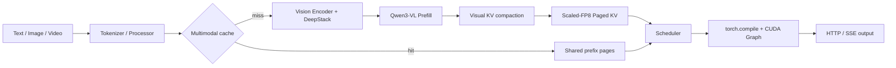

# Prism-Infer

面向 **Qwen3-VL** 的多模态推理引擎，重点优化 Decode 延迟、KV Cache 容量和重复媒体请求。

Prism-Infer 从模型执行层开始实现 Qwen3-VL 推理，包括 Vision Encoder、DeepStack、
M-RoPE、Paged KV Cache、Continuous Batching、HTTP/SSE Serving 和双卡 Tensor
Parallel。项目没有照搬通用推理框架，而是围绕 Qwen3-VL 的实际流水做 profiler
分析，再决定哪些计算适合编译、融合、捕获或压缩。

多模态推理的问题不只在 Decode Kernel：图像和视频会产生很长的视觉前缀，占用大量
KV；同一媒体经常被重复提问；而动态页表和请求调度又很难直接放进编译图。这个项目把
这些问题放在同一套运行时里处理，而不是只做一个孤立的 Kernel Demo。

## 主要实现

- **Qwen3-VL 执行链路**：实现图像/视频输入、Vision Encoder、DeepStack、3D
  Position IDs、M-RoPE、Language Decoder 和 Sampling。
- **Scaled-FP8 KV Cache**：K/V 使用 E4M3FN，每个 token、每个 KV head 保存独立
  FP32 scale，并支持写入、Paged Attention、CoW、Swap 和页压实。
- **视觉 KV 压实**：根据注意力分数保留重要视觉 token，移动有效 KV 并释放空页，
  M-RoPE 逻辑位置不随物理页变化。
- **多模态前缀缓存**：根据媒体内容和 prompt 生成缓存 key，复用 Processor、
  Vision/DeepStack 输出和已经压实的 KV 页，而不是依赖 Python 对象身份。
- **torch.compile + CUDA Graph**：编译稳定的 QKV、QK-Norm 和 M-RoPE 计算，
  CUDA Graph 负责完整 Decode，包括 Paged Attention、LM Head、选词和 TP2 NCCL。
- **双卡 TP2**：按 rank 切分 QKV、MLP、词表和 KV heads；row-parallel 层使用
  NCCL AllReduce，greedy decoding 只交换每张卡的局部 top-1。
- **在线推理**：支持 Chunked Prefill、Continuous Batching、SLO-aware Scheduling、
  请求取消、HTTP 非流式响应和 SSE 流式输出。

## 性能结果

测试模型为 Qwen3-VL-8B-Instruct，设备为 RTX 5090。对比版本为 vLLM 0.25.1 和
SGLang 0.5.15.post1；详细设置见 [Results](docs/RESULTS.md)。

### Decode 延迟

| 场景 | Prism | SGLang | vLLM |
|---|---:|---:|---:|
| TP1，8 张 448×448 图片，TPOT | **9.8821 ms** | 10.3520 ms | 10.5276 ms |
| TP1，16 帧 448×448 视频，TPOT | **9.8680 ms** | 10.3689 ms | 10.5278 ms |
| TP2，单图 batch 1，TPOT | **5.9701 ms** | 5.9701 ms | 6.1612 ms |

TP1 两组多模态测试中，Prism 的 TPOT 比 vLLM 低 6.13%–6.27%。TP2 单图测试中，
Prism 比 vLLM 低 3.10%，两者生成的 32 个 token 完全相同。SGLang TP2 的延迟与
Prism 接近，但从第 21 个 token 开始输出不同。

TP2 的优化主要作用于 Decode。当前单图 TTFT 为 86.057 ms，vLLM 为 61.251 ms；
Vision Encoder 仍在两张卡上各执行一次，这是后续最值得继续优化的部分。

### KV Cache

| 配置 | Token capacity | KV 存储 | 进程显存峰值 |
|---|---:|---:|---:|
| BF16 | 28,928 | 4,068.000 MiB | 23,938 MiB |
| Scaled-FP8，同容量 | 28,928 | 2,097.562 MiB | 21,966 MiB |
| Scaled-FP8，约 4 GiB KV | 56,320 | 4,083.750 MiB | 23,952 MiB |

Scaled-FP8 将 KV 存储减少 **48.44%**，同等 KV 预算下 token capacity 提升
**94.69%**。它的目标是提升容量，不是降低单 token 延迟。

### 重复媒体请求

60 请求、4 req/s、output 64：

| 媒体重复率 | Prism raw / Goodput | vLLM raw / Goodput |
|---:|---:|---:|
| 0% | 216.188 / 133.316 | **223.079 / 215.643** |
| 50% | 217.083 / 206.228 | **223.521 / 219.796** |
| 75% | 224.279 / 224.279 | **225.112 / 225.112** |
| 100% | 224.369 / 224.369 | **225.004 / 225.004** |

媒体重复率达到 75% 后，Prism 与 vLLM 的吞吐差距缩小到 0.28%–0.37%。没有缓存
命中时，冷 Vision/Prefill 会打断 Decode 节奏，vLLM 仍然更快。

## 推理流程



`torch.compile` 只处理形状稳定的计算；KV 页表、slot mapping 和请求调度仍由运行时
管理。这样既能利用 Inductor，又不会把动态 KV 状态塞进编译图。TP2 中，每个 rank
独立运行编译后的 QKV 子图，外层 CUDA Graph 再捕获 NCCL 和完整 Decode。

## 快速开始

项目支持 Python 3.10–3.12。RTX 5090 测试环境使用 Python 3.12、PyTorch
2.11.0+cu130 和 Transformers 5.14.1。

```bash
git clone https://github.com/xsmccc/Prism-Infer.git
cd Prism-Infer

python3.12 -m venv .venv
source .venv/bin/activate
python -m pip install --upgrade pip
python -m pip install -e ".[blackwell,serving]"

export PRISM_MODEL_PATH=/path/to/Qwen3-VL-8B-Instruct
python example.py
```

启动 HTTP/SSE 服务：

```bash
prism-serve \
  --model "$PRISM_MODEL_PATH" \
  --host 127.0.0.1 \
  --port 8000
```

双卡 TP2：

```bash
CUDA_VISIBLE_DEVICES=0,1 prism-serve \
  --model "$PRISM_MODEL_PATH" \
  --engine-config configs/tp2_graph.json \
  --host 127.0.0.1 \
  --port 8000
```

## 代码结构

```text
prism_infer/
  engine/       Scheduler、Paged KV、Prefix Cache、Tensor Parallel
  models/       Qwen3-VL Language Model、Vision glue、DeepStack
  vision/       Vision Encoder、Attention、M-RoPE
  layers/       Linear、Norm、Attention、Sampler
  ops/          Triton KV Store、Paged Decode、Compaction、Fused Kernels
  serving/      HTTP/SSE Runtime
  analysis/     Benchmark 与 Profiler 分析
benchmarks/     Offline、Online、vLLM/SGLang 对比脚本
configs/        Serving 和 TP2 配置
```

## 文档

- [架构设计](docs/ARCHITECTURE.md)
- [性能结果](docs/RESULTS.md)
- [运行与复现](docs/REPRODUCIBILITY.md)

## 当前支持

Prism-Infer 当前面向 Qwen3-VL，完成了单机 TP1/TP2、多模态 Continuous Batching、
Paged KV、FP8 KV、CUDA Graph 和原生 HTTP/SSE。暂未实现 PP、多机 TP、MoE Expert
Parallel 和 OpenAI-compatible API。

## 致谢与许可

项目早期运行时结构参考了
[nano-vllm](https://github.com/GeeeekExplorer/nano-vllm)，之后扩展为面向 Qwen3-VL
的多模态推理实现。项目使用 [MIT License](LICENSE)。
