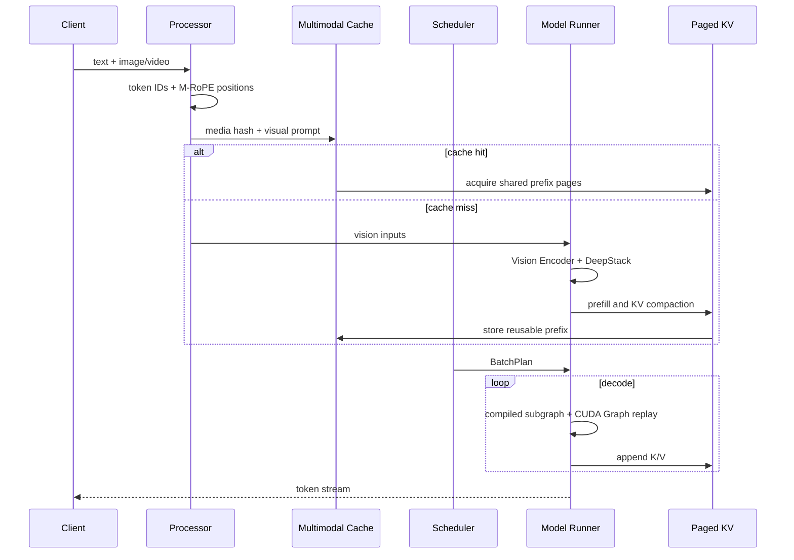

# 架构设计

Prism-Infer 是一个面向 Qwen3-VL 的单机推理引擎。Tokenizer 和 Processor 来自
Hugging Face，模型 Forward、KV Cache、调度、Tensor Parallel 和 Serving Runtime
由项目自己实现。

## 1. 请求流程



Scheduler 每一步生成一个 `BatchPlan`，其中包含请求阶段、token 数、页表和调度操作。
Executor 按顺序完成页复制、Swap、Prefill、Decode 和资源回收。请求可以处于 waiting、
running、swapped、completed、cancelled 或 failed 状态。

## 2. Qwen3-VL 模型

模型路径包括：

- Text Embedding、Decoder、LM Head；
- Q/K RMSNorm、Grouped-Query Attention 和 MLP；
- Vision Transformer、Patch Merger 和 DeepStack；
- 单图、多图、视频以及混合 batch；
- Qwen3-VL 3D Position IDs 和 M-RoPE delta；
- Greedy 和 Temperature Sampling。

视觉 KV 压实时，序列同时保存逻辑 token 位置和物理 KV 位置。删除一部分视觉 KV
只会改变页表与 Attention 读取位置，不会改变保留 token 的 M-RoPE 坐标。

## 3. torch.compile 与 CUDA Graph

Decode 中并不是所有内容都适合交给 compiler。Prism 将稳定计算和动态状态分开：

- `torch.compile` 处理 QKV Projection、QK-Norm 和 M-RoPE；
- CUDA Graph 捕获固定 batch bucket 的完整 GPU Decode；
- Paged KV 页表、context length、slot mapping 和 FP8 scale 使用固定地址 Tensor；
- Prefill、请求加入、缓存淘汰和页分配仍在普通运行时中执行。

TP1 的 Graph 可以覆盖模型 Forward、LM Head 和 greedy token selection。TP2 中，
每个 rank 运行自己的 compiled QKV 子图，外层 Graph 再捕获 Paged Attention、NCCL
AllReduce、LM Head 和分布式 top-1。

```text
host state update
  -> rank-local compiled QKV/QK-Norm/M-RoPE
  -> KV store
  -> Paged Attention
  -> NCCL AllReduce
  -> LM Head
  -> distributed greedy top-1
```

低精度候选选择不会直接决定输出。最终 token 由 FP32 重排得到，候选间距过小时回到
完整精度路径。

## 4. Tensor Parallel

TP2 切分语言模型，Vision Encoder 暂时复制执行。

Column-parallel：

- Q/K/V Projection；
- MLP Gate/Up；
- Vocabulary Embedding；
- LM Head；
- 每张卡对应的 KV heads。

Row-parallel：

- Attention Output Projection；
- MLP Down Projection；
- 使用 NCCL AllReduce 合并部分结果。

Greedy Decode 时，每个 rank 先计算本地最大 logit 和全局 token ID，然后通过一次小型
AllGather 决定最终 token，不需要汇总完整词表。非 greedy sampling 仍会收集完整
logits。

batch1 快路径只发送当前 token、M-RoPE position、KV slot、context length 和 block
table。每个 rank 将这些数据写入自己的 pinned host buffer，然后 replay CUDA Graph。
其他 batch size 继续使用通用 `BatchPlan` 路径。

## 5. Paged KV 与 Scaled-FP8

每条序列通过 block table 映射到物理 KV pages。Prefix Sharing 使用只读共享页；写入
共享尾页时执行 Copy-on-Write。Swap 会同时移动 payload、scale 和页元数据。

Scaled-FP8 格式：

```text
K/V payload: E4M3FN
K scale:     FP32[token, kv_head]
V scale:     FP32[token, kv_head]
```

scale 与 K/V 一起经历 Store、Paged Attention、CoW、Swap、Compaction 和 Graph
Replay。直接将 BF16 KV 转成 unit-scale FP8 的质量较差，因此最终实现使用动态
per-token、per-head scale。

## 6. 视觉 KV 压实

Prefill 后，从选定 Decoder Layer 收集视觉 token 的 Attention 分数。图片和视频使用
不同的保留比例与最小 token 数。Coordinator 随后：

1. 计算要保留的视觉 token；
2. 将对应 K/V 和 scale 移动到连续位置；
3. 更新 block table 和 physical context length；
4. 释放已经空出的 pages；
5. 保留原始 M-RoPE logical positions。

与 Attention Mask 不同，物理压实会真正释放 KV pages，让后续请求可以使用这些空间。

## 7. 多模态前缀缓存

缓存分为两层：

```text
model / processor version + media bytes + dtype + shape
    -> Processor、Vision、DeepStack cache

上面的 key + visual prompt tokens
    -> compacted prefix KV cache
```

同一媒体更换问题时，可以复用 Processor 和 Vision 结果；只有视觉 prompt 也相同时，
才会继续复用 Prefix KV。文件输入根据文件内容计算 key，而不是使用文件路径。无法稳定
序列化的输入不进入缓存。

Prefix Cache 持有只读完整页。最后一页未填满时，请求获得自己的 tail page；tail page
结束使用后回到复用池，避免每次重新申请和复制。

## 8. 调度与 Serving

运行时记录 TTFT、TPOT、E2E、吞吐、Goodput、KV pages 和 Cache 命中。Scheduler
支持 FCFS、Chunked Prefill 和基于剩余时间的 SLO 调度。

实验中，连续加入较重的 Vision Prefill 会打断已有 Decode，因此调度器会控制 Prefill
粒度并考虑 Decode 请求的剩余时间。HTTP Runtime 支持普通 JSON 响应、SSE Token
Stream、取消请求和退出时释放显存。

## 9. 当前实现情况

- TP1 和 TP2 已在 RTX 5090 上完成图像、视频、混合 batch 和 HTTP/SSE 测试；
- TP2 的 Vision Encoder 仍然复制执行，尚未实现 Vision Parallel；
- Dynamic Vision Tensor Graph 在混合 shape 下会改变首 token，因此默认关闭；
- Prefix Cache 位于单个 Engine Process 内，尚未做跨进程或跨机器共享；
- 当前 Serving API 为项目自有格式，不兼容 OpenAI API。
