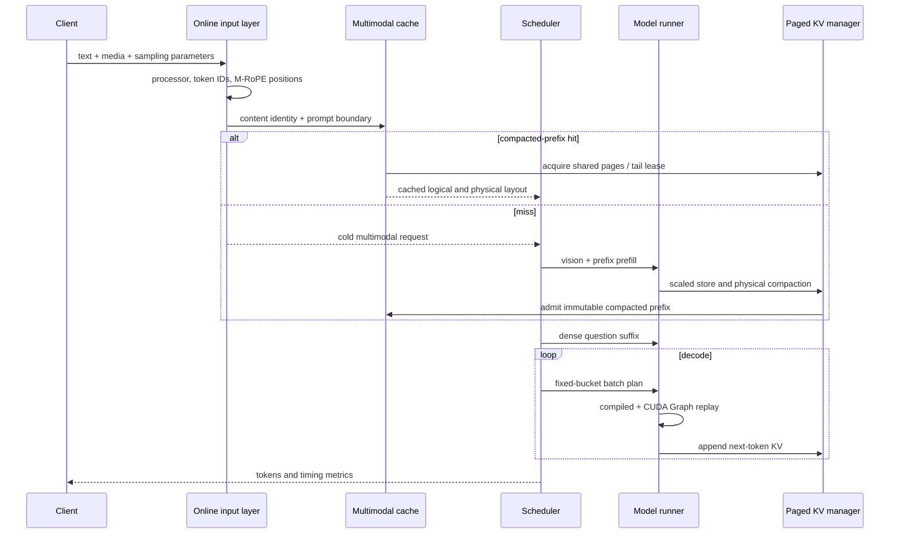

# Architecture

## 1. Scope

Prism-Infer is a single-node research inference engine for Qwen3-VL. The
runtime owns model execution, multimodal positions, paged KV storage,
scheduling, decode acceleration, and a native HTTP/SSE boundary. Hugging Face
is used for tokenizer, processor, configuration, and numerical references; it
is not used as the model forward or engine wrapper.

The design is organized around two paths:

- a latency profile using BF16 KV with compiler/Graph decode; and
- a memory profile using scaled-FP8 KV, optional visual KV compaction, and
  content-addressed multimodal prefix reuse.

## 2. Request lifecycle



Requests move through explicit waiting, running, swapped, completed, cancelled,
or failed states. The scheduler produces a `BatchPlan`; the executor applies
page copies, swaps, prefill, decode, and resource release in that order.

## 3. Qwen3-VL model path

The model implementation covers:

- text embeddings and decoder layers;
- Q/K RMSNorm, grouped-query attention, MLP, and LM head;
- Vision Transformer patch embedding, attention, merger, and DeepStack
  features;
- single image, multiple image, video, and mixed batches;
- Qwen3-VL 3D position IDs and M-RoPE deltas; and
- greedy and temperature sampling.

The position model is important for compression. A sequence keeps logical
token positions independently from the compacted physical KV row indices.
Dropping a visual KV row therefore changes storage and attention lookup, not
the semantic M-RoPE position of the retained token.

## 4. Compiler and CUDA Graph boundary

`torch.compile` is useful only where shapes and ownership can be made stable.
Prism-Infer divides decode accordingly:

- stateless decoder work, output projection, and selected token computation
  can be compiled;
- fixed batch buckets are captured by CUDA Graph;
- page tables, physical context lengths, slot mappings, K/V payloads, and
  FP32 scale caches are persistent replay tensors updated by the runtime; and
- dynamic request admission, prefill, cache eviction, and page ownership stay
  outside the compiled region.

This avoids asking the compiler to own a mutable serving state machine. Graph
replay covers the GPU decode path rather than merely wrapping a Python
function whose kernels still launch individually.

The greedy fast path may generate a reduced candidate set in lower precision,
but the final winner is decided by precise reranking. Ambiguous low-margin
cases use the exact fallback. This is a guarded fast path: approximate
computation narrows work but does not define the final token.

## 5. Tensor-parallel boundary

TP2 keeps media preprocessing and the Qwen3-VL vision encoder replicated while
sharding the language path:

- Q/K/V projections, KV heads, packed MLP gate/up, vocabulary embedding, and
  LM-head rows are split across ranks;
- attention output and MLP down projections consume sharded activations and
  all-reduce their partial outputs;
- each rank stores only its local KV heads; and
- vocabulary embedding masks non-local token IDs before an all-reduce.

For greedy decode, every rank computes its local BF16 LM-head projection and
local top-1. A single all-gather exchanges one value and one global token ID
per sequence; all ranks deterministically choose the same global maximum. The
generic non-greedy path retains a full vocabulary gather because sampling
requires the complete distribution.

CUDA Graph captures the NCCL collectives inside fixed decode batch buckets.
All ranks resolve the same sampling mode before capture/replay, while rank 0
alone returns user-visible tokens. The control plane sends typed rank-0
commands and waits for worker acknowledgements for lifecycle operations.

`compile_graph` remains TP1-only: its stateless compiled region predates the
row-parallel reductions and would otherwise bypass distributed ownership.
TP2 therefore uses the validated `cuda_graph` backend and fails closed for
unsupported compiler/precision combinations rather than silently falling back
to a different algorithm.

## 6. Paged KV and scaled-FP8

The paged cache separates logical sequences from physical pages. A block table
maps each active sequence to GPU pages; copy-on-write protects shared prefixes,
and swap metadata preserves recoverable page state.

The validated FP8 format stores:

- K and V payload in E4M3FN;
- independent FP32 K/V scales for every token and KV head; and
- the same scale lifecycle as the payload through store, attention, CoW,
  swap, compaction, and Graph replay.

Direct unit-scale casting is retained only as a rejected baseline. It reduced
storage but did not satisfy the long-output quality protocol.

## 7. Visual KV physical compaction

For a cold multimodal prefill, selected decoder attention statistics score
visual tokens. The retained policy is modality-aware:

- image and mixed requests keep a larger minimum floor;
- video-only requests use a smaller floor; and
- the keep ratio is bounded by those floors.

The compaction coordinator builds a new layout, moves retained KV rows,
rewrites the page table, releases pages that become empty, and records the
original logical positions. Decode then appends dense text KV after the
compacted visual prefix.

This differs from logical pruning. A mask can reduce attended tokens but leaves
the allocated pages occupied. Physical compaction returns pages to the block
pool so later requests can use them.

## 8. Content-addressed multimodal prefix cache

The cache identity is layered:

```text
model + processor namespace
  + exact media content and layout
    -> processor / Vision / DeepStack identity
  + exact prompt tokens through the final visual placeholder
    -> compacted prefix-KV identity
```

Supported media types are hashed with length-delimited SHA256 over bytes,
decoded pixels, dtype, shape, and recursively ordered containers. File inputs
use file contents rather than path strings. Unsupported opaque values fail
closed instead of falling back to `repr()` or object identity.

Two cache levels separate media-invariant work from prompt-specific work:

1. processed media and Vision/DeepStack tensors can be reused when the
   question changes after the last visual placeholder;
2. compacted prefix KV can be reused only when the exact visual prompt prefix
   also matches.

The question suffix and generated tokens are never included in the reusable
visual prefix.

### Page ownership

An admitted prefix holds reference-counted, read-only full pages. If its final
page is partial, a concurrent request receives a private tail page containing
only valid prefix rows. Tail clones return to a bounded pool and can be leased
again, avoiding repeated copy traffic.

Eviction is bounded by retained pages and observed benefit. Cache cleanup
releases owned prefix and tail pages during engine shutdown.

## 9. Scheduling and serving metrics

The serving path tracks:

- queue delay and TTFT;
- per-request TPOT and end-to-end latency;
- raw output throughput;
- class-conditioned SLO attainment and Goodput;
- KV pages, logical/physical prompt tokens, cache hits, copies, and evictions;
- cancellations, failures, and memory release.

The retained scheduler can estimate latest-start slack and request cost.
Optimizing one latency number is not sufficient: experiments showed that
eagerly admitting heavy prefills can improve their TTFT while fragmenting
decode cadence and reducing Goodput.

## 10. Safety and known boundaries

- Dynamic Vision Tensor Graph is disabled for mixed-shape loaded serving
  because a frozen workload exposed incorrect first tokens.
- TP2 is validated on one host with two RTX 5090 GPUs for exact greedy output,
  CUDA Graph decode, mixed multimodal continuous batching, and native serving.
  Vision compute is replicated; `compile_graph`, pipeline parallelism,
  multi-node TP, and non-greedy TP2 performance are not validated.
- Prefix persistence is within one engine process, not a distributed or
  cross-tenant cache.
- Native HTTP/SSE serving is a research interface, not an OpenAI-compatible
  production service.
