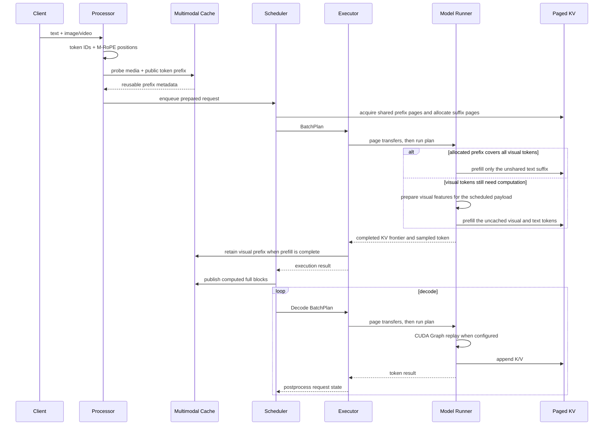

# 架构设计

Prism-Infer 是一个面向 Qwen3-VL 的单机推理引擎。Tokenizer 和 Processor 来自
Hugging Face，模型 Forward、KV Cache、调度、Tensor Parallel 和 Serving Runtime
由项目自己实现。

## 1. 请求流程



Scheduler 每一步生成一个 `BatchPlan`，其中包含请求阶段、token 数、页表和调度操作。
Executor 先执行 Swap-in、Swap-out 和页复制，再运行选定的 Prefill 或 Decode。
请求可以处于 waiting、running、swapped、completed、cancelled 或 failed 状态。

入队前的 Prefix probe 只提供复用信息，不执行语言 Prefill，也不提前拥有共享页。
调度分配时才确认可用的前缀并取得页引用；如果等待期间缓存被淘汰，请求按实际命中范围
继续计算。视觉 Token Pruning 仅在显式选择压实配置时发生，不是上图所有 Prefill 的必经步骤。

## 2. Qwen3-VL 模型

模型路径包括：

- Text Embedding、Decoder、LM Head；
- Q/K RMSNorm、Grouped-Query Attention 和 MLP；
- Vision Transformer、Patch Merger 和 DeepStack；
- 单图、多图、视频以及混合 batch；
- Qwen3-VL 3D Position IDs 和 M-RoPE delta；
- Greedy 和 Temperature Sampling。

视觉 KV 压实时，序列同时保存逻辑 token 位置和物理 KV 位置。删除一部分视觉 KV
只会改变页表与 Attention 读取位置，不会改变保留 token 的 M-RoPE 坐标。

## 3. torch.compile 与 CUDA Graph

`torch.compile` 和 CUDA Graph 解决的是不同开销：前者编译选定的 Tensor 计算，后者
记录固定 shape 的 GPU 提交序列。仅选择 `cuda_graph` 不会自动启用 `torch.compile`。
`compile_graph` 的 `decode_compile_region` 有两种实现，不能混为一条路径：

| Region | 编译内容 | 适用配置 |
|---|---|---|
| `stateless` | batch-1 Attention 输出投影，以及 FP8 LM-head 候选投影 | TP1；与 Scaled-FP8 KV 可组合 |
| `attention` | QKV Projection、Q/K RMSNorm 和 M-RoPE | KV compression 为 `off`；TP2 的 compile 路径使用该 region |

`stateless` 是代码中的配置名，表示这些编译函数不负责页分配或修改 Scheduler 状态，
不是“整个 Decode 没有状态”。O-proj 编译路径只替换 batch-1 投影，其他 bucket 继续使用
原路径。KV 写入、Paged Attention 和采样等操作由外层 Decode Graph 捕获，不属于这两个
编译函数的范围。实现入口是 `ModelRunner._configure_decode_compile()`。

CUDA Graph 按 batch bucket 捕获固定 shape 的 GPU Decode。页表、context length、
slot mapping 和 FP8 scale 使用固定地址 Tensor，replay 前更新内容。TP1 的 Graph 可
覆盖模型 Forward、LM Head 和 greedy token selection；TP2 在各 rank 的 Graph 中
执行局部模型计算、NCCL AllReduce 和分布式 top-1。启用 TP2 `attention` 编译时，
其中的 QKV/QK-Norm/M-RoPE 才由编译函数执行。Prefill、请求加入、淘汰和页分配仍在普通
运行时中执行，没有被这些 Decode Graph 捕获。

TP1 `stateless` 配合 `logits_precision=selective_fp32` 时，FP8 LM-head 投影先选出
Top-64 token，再用原始 BF16 权重和 hidden state 做 FP32 dot products，在候选中选最大值。
它没有低 margin 检测，也没有自动回到全词表 FP32 计算的分支。重排可以纠正候选之间的
排序，但不能找回已被 FP8 Top-64 排除的全词表最大值，因此不能表述为对所有输入都精确。
原始权重仍保留，FP8 候选权重是额外的显存开销，不是权重压缩后的替代副本。

## 4. Tensor Parallel

TP2 切分语言模型。Vision Encoder 默认复制执行，也可通过
`vision_encoder_parallel_mode=data` 按完整图片分工，再收集主特征和全部 DeepStack，
恢复原始媒体顺序。视频路径不变，详见[多卡实现](MULTI_GPU.md)。

Column-parallel：

- Q/K/V Projection；
- MLP Gate/Up；
- Vocabulary Embedding；
- LM Head；
- 每张卡对应的 KV heads。

Row-parallel：

- Attention Output Projection；
- MLP Down Projection；
- 使用 NCCL AllReduce 合并部分结果。

Greedy Decode 时，每个 rank 先计算本地最大 logit 和全局 token ID，然后通过一次小型
AllGather 决定最终 token，不需要汇总完整词表。非 greedy sampling 仍会收集完整
logits。

batch1 快路径只发送当前 token、M-RoPE position、KV slot、context length 和 block
table。每个 rank 将这些数据写入自己的 pinned host buffer，然后 replay CUDA Graph。
其他 batch size 继续使用通用 `BatchPlan` 路径。

## 5. Paged KV 与 Scaled-FP8

每条序列通过 block table 映射到物理 KV pages。Prefix Sharing 使用只读共享页；写入
共享尾页时执行 Copy-on-Write。Swap 会同时移动 payload、scale 和页元数据。

Scaled-FP8 格式：

```text
K/V payload: E4M3FN
K scale:     FP32[token, kv_head]
V scale:     FP32[token, kv_head]
```

scale 与 K/V 一起经历 Store、Paged Attention、CoW、Swap、Compaction 和 Graph
Replay。直接将 BF16 KV 转成 unit-scale FP8 的质量较差，因此最终实现使用动态
per-token、per-head scale。

## 6. 视觉 KV 压实

默认保留全部视觉 token；`scaled_fp8_kv` 只改存储精度，不执行 Token Pruning。
显式选择 `visual_compact*` 配置后，Coordinator 才按策略产生视觉 token 保留表。
运行时支持 Uniform 和 Attention 两种选择方式。历史重复提问实验采用 Uniform，按位置
均匀选取、不使用问题 Attention 分数，让同一份压实 KV 可被不同问题复用；这不代表对
任务质量没有影响。Attention Top-k 保留为质量对照，用来比较“每题重新选择”和“沿用
第一题选择”，不是默认服务路径。

得到保留表后，运行时：

1. 计算要保留的视觉 token；
2. 将对应 K/V 和 scale 移动到连续位置；
3. 更新 block table 和 physical context length；
4. 释放已经空出的 pages；
5. 保留原始 M-RoPE logical positions。

与 Attention Mask 不同，物理压实会真正释放 KV pages，让后续请求可以使用这些空间。
代码中图片剪枝参数的默认值是 `visual_pruning_keep_ratio=0.6`、
`visual_pruning_min_keep_tokens=32`；没有启用压实模式时，这些值不会触发删除。
历史 working-set 实验把最少保留数显式改为 768，不应把该实验值当成运行时默认值。
该最少保留数作用于一个请求的全部视觉 token，不是每张图片各保留这么多；请求总视觉
token 数不超过它时不删除。页数收益还受到 256-token page 粒度影响，不能简单按 40%
估算。纯视频请求在 `visual_pruning_video_min_keep_tokens=None` 时不删除。公开Serving
每请求选择一种媒体modality，`generate_mixed`也是多条单模态请求组成batch；保留数按
各自Sequence计算，不会把同batch的图片与视频token合成一个全局floor。

## 7. 多模态前缀缓存

CPU 媒体预处理缓存复用 Processor 的 pixel/grid Tensor 和媒体身份；可选的视觉输出
缓存复用 Vision Encoder 主输出及 DeepStack。Prefix KV Cache 则保留语言模型各层的
公共前缀 K/V。前两者不依赖问题后缀，但只有 Prefix KV 命中才能直接跳过公共前缀的
语言 Prefill。三种缓存的生命周期不同，不能把“Processor 命中”当成“KV 命中”。

重复提问路径把有序媒体放在问题之前，并保留显式编号：

```text
Image 1: <image>
Image 2: <image>
...
Question: ...
```

编号用于保持多图对应关系；最后一个视觉占位符之前的精确 token 序列是可复用公共
前缀，entry 级缓存不含问题文本。Dense block-level APC 还可保留之后已计算完成的文本
整块，只有它们及其全部左侧上下文一致时才复用。

请求入队前先按媒体与公共 prompt 身份探测 Prefix Cache，随后交给 Scheduler。
真正分配页时再确认可用前缀并增加共享引用，然后才执行 Prefill：完整视觉命中只计算问题
后缀，不准备视觉特征。`ModelExecutionBackend.prepare()` 在
`runner.prefill.visual_cache` 区间调用 `prepare_prefill_visual_cache(plan)`：本次
Prefill slice 包含完整视觉 payload 时，才查询或构建启用的 Vision/DeepStack 缓存。
视觉输出全部命中时，不再把原始 pixels 传到 GPU；缺失时才传输并编码。

部分视觉 Prefix 命中时沿用 `InputPreparer` 的整图切片路径，只编码未覆盖的媒体，
不为已经有 KV 的图片恢复特征；这个分支不保证利用 Encoder Cache。语言 KV 计算完成
后才发布缓存：Executor 保存可复用视觉 Prefix Entry，Scheduler postprocess 发布已计算
完整块的索引；可选压实也在计算完成后进行。这样入队前的 probe 不会隐含一次 GPU 编码。

Prefix ID 由模型与 Processor 布局、按顺序排列的媒体 SHA256、公共 prompt token 数和
完整 token SHA256 直接得到，随后做字典查找；构造身份仍需遍历输入。命中后仍比较媒体 key、公共长度和完整
token 序列；摘要碰撞会直接报错，不会复用错误 KV。文件输入按内容计算身份，不依赖
路径或 Python 对象地址。

Block-level APC 使用链式 key：当前块的 token 和媒体身份与上一块 hash 一起决定当前
块身份，因此只复用从 token 0 开始连续一致的公共前缀。逐图媒体身份不是独立的
Transformer KV key；图片重排、非前缀子集或前置文本变化会在首个差异处结束复用。
逐图 Vision Encoder Cache 与语言模型 KV Cache 分离，可以复用视觉编码结果，但不会
绕过因果前缀约束。

物理页分配不等于 KV 已计算。完整页在 Prefill chunk 或 Decode 的 KV 写入完成后，由
Scheduler postprocess 调用 `publish_computed_blocks()` 加入命中索引。取消未完成请求时，
尚未计算的页没有可命中的 hash；已经完成的整块可按原策略保留。

早期查询和真正分配 KV 之间可能发生淘汰。因此原始媒体 Tensor 保留到分配完成；若条目
已经被回收，请求自然回到完整 Vision + Prefill 路径。运行时分别记录
`pre_admission_hits`、`visual_hydration_skips` 和 `stale_probe_fallbacks`，可以确认命中
是否真的绕过视觉计算。

Prefix Cache 持有只读完整页。最后一页未填满时，请求获得自己的 tail page；tail page
结束使用后回到复用池，避免每次重新申请和复制。缓存不再只占 KV Pool 的八分之一，
而是可以使用全部暂时空闲页。活跃请求分配、追加、CoW 或 Swap-in 需要空间时，先回收
空闲 tail page，再按 `benefit_tokens × (1 + hits) / resident_pages` 淘汰完整条目；仍被
活跃请求引用的共享页不会释放。多个缓存 entry 可能共同引用一个页，回收容量按唯一
物理页计算：当页的全部引用均来自待淘汰缓存时，该页可回收，不能简单要求引用数等于 1。

## 8. 调度与 Serving

运行时记录 TTFT、TPOT、E2E、吞吐、KV pages 和 Cache 命中。Scheduler 支持
Continuous Batching、FCFS 和显式开启的 Chunked Prefill。Chunked Prefill 默认关闭，
因为现有实现把同一请求首个到最后一个视觉 token 视为完整区间；开启后若
`max_chunk_size` 小于该区间长度，会拒绝请求，不会自动按图片切开。这一限制与
Prefix 部分命中后的整图切片是两件事。

连续加入较重的 Vision Prefill 仍会打断已有 Decode；支持 Chunked Prefill 不等于已经
实现 Prefill/Decode 混合批次，也不表示可以在任意视觉 token 位置切开。
HTTP Runtime 支持普通 JSON 响应、SSE Token Stream、取消请求和退出时释放显存。

当前仍是同步的 schedule → execute → postprocess 步进，不是异步 CPU/GPU 调度。
HTTP 的 CPU 媒体准备可在后台线程运行，模型执行和 KV 状态仍由单个 owner 管理。
TP1 可显式启用 cooperative Prefill，在 Vision block／语言层之间执行独立 Decode
批次；这不是同一批内混合 Prefill/Decode。普通 FCFS 不再等待 250 ms 凑批，按配置
指定层数推进；无可执行的驻留 Decode 时先完成 Prefill。取消暂停批次的一条请求后，
其余请求保留已提交前沿并重算未完成片段。该路径默认关闭，原因和测量见
[交错执行记录](PREFILL_INTERLEAVING.md)。

可选 Vision Cache 的 miss 仍在选中 Prefill 的准备阶段整体编码，再进入后续模型执行。
因此即使开启 cooperative Prefill，这条缓存准备路径也不会按 Vision block 让出 GPU；
不能把普通视觉模型的分段执行能力套用到所有 Encoder Cache miss。

Scaled-FP8 Prefix 命中的 Attention 从 Context 保存的 CPU offsets 读取长度，按有效页数
截取页表；不会逐层把长度或页号读回 CPU。KV 仍会 gather/反量化到连续临时张量，再用
`causal_lower_right` 对齐后缀的因果范围，并由支持 GQA 的 SDPA 后端执行 Attention。
这解决逐层同步和手工 K/V head 复制，但不是直接读取 FP8 页的融合 Prefill kernel。

当前 CUDA 路径在一个 Triton kernel 中完成 K/V gather 和反量化，保留原来的 dtype
舍入顺序，再交给上述 SDPA。短后缀也使用原生均值归约的 Q/K RMSNorm-M-RoPE 融合。
模型初始化的 CUDA 默认设备仅存在于 `with torch.device("cuda")` 作用域内，不在退出时
通过 `set_default_device("cpu")` 留下持续拦截 torch 调用的模式。详见
[短 Prefill 优化](PREFIX_PREFILL_OPTIMIZATION.md)。

FlashInfer Paged Prefill/Decode 需要显式开启，当前只支持未量化的 BF16/FP16 KV。
未安装可用后端、选择 FP8 KV 或将 `attention` 编译与 FlashInfer Decode 同时启用，
都会明确报错；FlashInfer Decode 的执行异常也不会静默改走 Triton。默认 TP1 FP8
配置使用项目的 Triton/SDPA 路径，不开启 FlashInfer。

## 9. 当前实现情况

- TP1 和 TP2 已在 RTX 5090 上完成图像、视频、混合 batch 和 HTTP/SSE 测试；
- TP2 已支持完整图片级 Vision Encoder 数据并行，视频仍使用原路径；
- Dynamic Vision Tensor Graph 在混合 shape 下会改变首 token，因此默认关闭；
- Prefix Cache 位于单个 Engine Process 内，尚未做跨进程或跨机器共享；
- 当前 Serving API 为项目自有格式，不兼容 OpenAI API。
