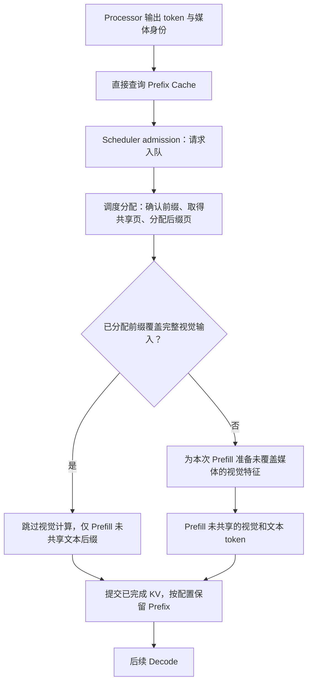

# 重复视觉上下文：设计、实现与验证

## 1. 场景与问题

目标负载是“同一组图片被多个独立请求以不同问题反复查询”。对这类请求，视觉内容和图片前面的公共
Prompt 不变，问题文本位于其后。

只缓存 Processor 或 Vision Encoder 输出仍不够：每个新问题都要让语言模型重新 Prefill
数百到数千个视觉 token。普通 Prefix Cache 可以复用完全相同的前缀，但长视觉前缀会快速
占满 KV Pool；当工作集超过显存预算时，前缀被淘汰后仍要重新执行语言 Prefill。
是否还要重做 Vision，取决于独立的视觉输出缓存是否命中，不能仅凭 KV 淘汰推断。

Prism-Infer 的处理方式是：

1. 用 media-first Prompt 构造与问题无关的公共视觉前缀；
2. 将公共前缀的 K/V 量化为 Scaled-FP8（per-token、per-KV-head scale），并保持
   Dense 布局；视觉 Token Pruning 与物理压实是显式选择的研究配置；
3. 把量化后的 Paged KV 作为可跨问题复用的缓存对象：entry 级整段复用 +
   从 token 0 开始连续匹配的 chained block-level APC；
4. 让缓存借用整个空闲 KV Pool，活跃请求需要空间时再回收（池层 lazy retention
   与按复用收益保留 entry 的两级缓存）；
5. 用请求级记录和 Nsight Trace 同时验证容量、延迟、质量和真实执行路径。

这里没有提出新的视觉 token 选择算法。主路径不删除视觉 token；Uniform 是可选剪枝
对照。工程工作在于模型适配、量化、页所有权、内容身份和在线请求路径的组合实现。

## 2. Prompt 与缓存身份

同一组图片使用固定顺序和显式编号：

```text
Image 1: <image>
Image 2: <image>
...
Question: ...
```

Entry 级公共前缀结束于最后一个视觉占位符。Dense block-level APC 还可索引之后已计算
完成的文本整块，但只有包括问题在内的全部左侧上下文一致时才能复用。
编号保留多图之间的对应关系；质量实验单独比较了该布局与数据集官方交错布局的差异。

Prefix Cache ID 由以下内容直接计算：

```text
model / processor namespace
+ ordered media content SHA256
+ processor layout and media tensor identity
+ public prefix token count
+ exact public prefix token SHA256
```

文件输入按内容计算身份，不依赖文件路径或 Python 对象地址。Cache ID 直接进入字典查询，
平均查找复杂度为 O(1)。命中后仍比较媒体 key、公共前缀长度和完整 token 序列；摘要碰撞
不会静默复用错误 KV。

相关实现：

- `prism_infer/engine/media_preprocessing.py`：共享预处理缓存和媒体身份；
- `prism_infer/engine/sequence.py`：公共前缀边界和请求元数据；
- `prism_infer/engine/block_manager.py`：Prefix Entry、页引用和回收。

## 3. Prefix-first 请求路径

入队前只探测 Prefix Cache；页引用获取和模型计算由随后调度出的 Prefill 执行。
这里的完整命中指实际分配的 Prefix 覆盖全部视觉 token，不是仅有一次早期 probe 命中。



视觉缓存 hydration 是取出或计算视觉特征，不等于语言 Prefill。它在
`ModelExecutionBackend.prepare()` 选定的 Prefill 中执行，不在请求入队前发生。
本次 slice 包含完整视觉 payload 时，可查询或构建启用的 Vision/DeepStack 缓存，
缓存全部命中不再传输原始 pixels；部分视觉 Prefix 命中则使用已有的整图切片路径，
只编码未覆盖媒体，不保证这条分支还利用 Encoder Cache。可选的视觉压实只对显式启用
该配置的请求执行，不是所有冷请求都要删 token。

如果查询和实际页分配之间发生淘汰，请求仍持有原始媒体 Tensor。分配时发现条目消失后，
请求记录一次 `stale_probe_fallbacks`，然后按实际可复用范围准备视觉特征并执行 Prefill，
不会使用失效页；是否重做 Vision 仍取决于视觉输出缓存。

运行时公开三项关键计数：

- `pre_admission_hits`：调度准入前发现的 Prefix 命中；
- `visual_hydration_skips`：命中后真正跳过视觉缓存恢复的次数；
- `stale_probe_fallbacks`：早期命中但分配前条目已被回收的次数。

相关实现位于 `prism_infer/engine/llm_engine.py` 和
`prism_infer/engine/block_manager.py`。

## 4. Scaled-FP8 与物理压实

KV 格式为：

```text
K/V payload: E4M3FN
K scale:     FP32[token, kv_head]
V scale:     FP32[token, kv_head]
```

K/V 和 scale 一起经过 Store、Paged Attention、Copy-on-Write、Swap、Compaction 和 CUDA
Graph Replay。scale 开销包含在容量计算中，因此同 token capacity 的实际 KV 存储减少
48.44%，而不是简单写成 50%。

显式启用 Uniform 压实后，图片 Prefix Prefill 完成时生成视觉 token 保留表。运行时把保留 token
的 K/V 与 scale 移动到连续物理 slot，更新 block table 和 physical context length，再释放
空出的页。保留 token 的原始 M-RoPE logical position 不变；变化的只是 Attention 读取的
物理页位置。

```text
logical tokens:   [text][visual tokens................][suffix]
keep indices:            ^   ^  ^    ^       ^
physical KV:      [text][kept visual][suffix]
M-RoPE position:  保留原始 logical coordinates
```

历史 working-set 使用 `keep_ratio=0.6`，并把每请求全局最少保留数显式设为 768；
请求的总视觉 token 数不超过该数量时不删除，不是每张图片都单独受 768 的保护。
代码中默认最少保留数是 32，但只有显式启用 `visual_compact*` 时才使用这些参数。
`scaled_fp8_kv` 不删除 token。256-token page 粒度还会产生取整，因此容量收益必须从
真实 physical pages 读取，不能直接按 40% 估算。纯视频请求默认不删除；公开接口的
mixed batch是多条单模态请求，各自按Sequence计算保留量，不会跨请求合并视觉token。

物理搬移 Kernel 位于 `prism_infer/ops/kv_compaction.py`，量化 Store 与 Paged Decode 位于
`prism_infer/ops/kv_cache_store.py` 和 `prism_infer/ops/paged_decode.py`。

## 5. 页所有权与全池回收

Prefix Entry 持有只读共享页。请求命中后增加页引用；完成、取消或异常时仅释放该请求的
引用。仍被活跃请求引用的共享页不能被淘汰。

Prefix 最后一页通常未填满。若请求直接在共享尾页追加问题 token，会覆盖缓存；若每次
重新复制，又会产生重复分配和拷贝。因此请求使用私有 tail clone，完成后把可复用 clone
放回小型池。活跃请求需要页时，空闲 tail clone 是第一回收对象。

Prefix Cache 可以使用全部暂时空闲的 KV pages，不划分固定小池。分配、追加、CoW 或
Swap-in 缺页时：

1. 回收空闲 tail clones；
2. 按 `benefit_tokens × (1 + hits) / resident_pages` 选择完整 Prefix Entry；
3. 只释放没有活跃引用的 Entry；
4. 将腾出的页交给活跃请求。

该公式是简单的缓存效用启发式，不作为新的淘汰算法贡献。核心要求是让压实释放的页真正
扩大驻留工作集，同时保持请求页优先和引用安全。

## 6. 工作集设计

MuirBench 样本先按有序媒体 SHA256 分组，只保留至少包含两个不同问题的媒体组。媒体组按
内容哈希排序，不依据性能结果选样本。Dense Scaled-FP8 预运行记录每组真实 Prefix pages，
然后构造三种工作集：

| Workset | 媒体组 | 问题 | Dense pages | 与 220-page 预算关系 |
|---|---:|---:|---:|---|
| fit | 21 | 42 | 154 | 预算内 |
| knee | 28 | 56 | 224 | 刚超过预算 |
| pressure | 42 | 85 | 312 | 全部可用重复媒体组，141.8% |

每组先请求一次建立媒体工作集，随后运行 600 条 Zipf-1.0 请求。每条测量请求都切换到该
媒体组的另一个问题。Plan 保存请求到达时间、媒体组、问题 Sample ID、媒体 SHA256、
Prompt、Dense pages、模型 revision、KV 预算和生成参数。三套引擎读取同一个 Plan。

工作集生成与消费入口：

- `benchmarks/build_working_set_plan.py`；
- `benchmarks/run_working_set_matrix.py`；
- `benchmarks/working_set_workload.py`；
- `benchmarks/summarize_working_set.py`。

## 7. 结果与解释

2026-08-13 压实地址修复后的内部对照中，220-page 预算下，Dense/Compact 缓存驻留媒体组
为 27/40，Prefix 淘汰为 96/15；controller-start TTFT p50/p99 从 101.356/721.983 ms
变为 90.264/523.621 ms。这是当时 entry 级实现的数据，不能冒充当前 block-level APC
修复后的测量。

旧的“较 vLLM 低 24.52%/29.85%”来自压实地址修复前记录，不再用于性能结论。修复后的
三引擎历史配对实验比较的是 KV 预算收缩时各自的延迟变化；完整表格、计时定义和原始
JSON 入口集中在 [Results](RESULTS.md#1-重复视觉上下文)。

## 8. 质量对照

旧压实 kernel 的 int32 地址溢出影响了剪枝结果。MuirBench 的 27/49 → 20/49、MVBench
的 183/252 → 113/252 不再作为算法质量损失的依据。

修复后 MuirBench 全部 85 题为 Dense 46/85、Uniform 47/85；实际删除的同一组 49 题为
27/49、28/49，3/85 个答案不同。只能说该小样本未观察到准确率下降。这组对照不能单独
衡量 FP8 量化损失，也不能证明 Uniform 比 Attention Top-k 更好。

Attention Top-k 和 MVBench Compact 没有修复后的重跑结果；DocVQA 的 190 条样本没有
发生视觉 token 删除。默认保留全部视觉 token，相关历史取舍见
[未采用方案与历史实验](REJECTED_EXPERIMENTS.md)。

## 9. 执行路径证据

历史 Nsight Systems capture 包含一次冷请求和一次同媒体不同问题的 Prefix 命中请求。
Trace 观察到：

- 冷请求包含 Vision embedding cache miss；
- 命中请求没有 Vision 或 DeepStack range；
- 命中请求增加 `visual_hydration_skips`，没有 stale fallback；
- 275 个 prompt tokens 中有 145 个来自共享公共前缀；
- cold/hit GPU busy time 为 44.365/19.576 ms。

[`trace_audit.json`](../artifacts/working_set/trace/trace_audit.json) 保存上述路径观察，
[`prefix_hit.nsys-rep`](../artifacts/working_set/trace/prefix_hit.nsys-rep) 保存原始 capture。

## 10. 实现中解决的问题

### 查询顺序

Prefix 查询如果发生在视觉缓存恢复或编码之后，即使 KV 命中，也已经付出了部分不必要的
视觉处理成本。现在先在入队前 probe，调度分配后按实际未覆盖的媒体准备视觉特征。
早期查询、实际页复用和模型计算是三个不同的时点，不能把它们都简称为“命中”。

### 查找复杂度

遍历所有 Prefix Entries 比较 token 会让控制面开销随驻留条目增长。内容摘要现在直接
构造 Cache ID，再用完整 token 做碰撞保护。

### 页池利用率

把 Prefix Cache 限制在 KV Pool 的固定小区域会使压实释放的页无法转化为更多驻留媒体。
缓存改为借用全池空闲页，并让活跃请求分配触发安全回收。

### 早查与淘汰竞态

早期 probe 后条目可能在页分配前被其他请求淘汰。请求保留原始媒体直到分配完成，失效时
回到冷路径；该路径通过 `stale_probe_fallbacks` 单独观察。

### 尾页写入

共享未满尾页继续写入会污染其他请求。只读共享页、私有 tail clone、引用计数和回收顺序
共同处理完成、取消和 Swap。新尾页不能继承包含旧问题的整页哈希；本轮修复在复制时
只保留公共前缀行，在 KV 写入完成后重新发布完整页。

### 工作集语义

一个较早的工作集草案只按媒体分组，没有要求每组包含多个问题，实际流量主要是完全相同
Prompt 的重复。该数据未进入当前结果。现有 Plan 强制每组至少两个问题，并记录可用问题、
实际覆盖问题和逐组问题切换次数。

### 产物版本

Dense Page 预运行与 Working-set Plan 的生命周期不同。两者使用独立 schema version，
Plan 升级不再让未变化的 Dense Page 测量失效。

## 11. 与现有系统的关系

vLLM Automatic Prefix Caching 和 SGLang RadixAttention 都能复用 token Prefix；vLLM 还
提供 Processor/Encoder Cache。Prism 的差异不是“第一次实现 Prefix Cache”，而是把经过
Scaled-FP8 量化的页作为复用对象，并支持可选的视觉 token 压实。量化和剪枝都有数值或
上下文方面的取舍，不能仅凭容量收益宣称无损。

更完整的框架实现与论文对照见[相关工作与项目边界](RELATED_WORK.md)。

## 12. 限制

- 结果限定于 Qwen3-VL-8B、RTX 5090、TP1、给定 KV 预算与重复多图提问；
- 图片 Uniform 压实只有有限的修复后质量结果，不默认用于所有请求；
- 视频 token 删除默认关闭；
- Prefix Cache 不跨 Engine Process 或机器共享；
- 未实现自适应质量策略、训练式 selector 或跨节点缓存一致性。
