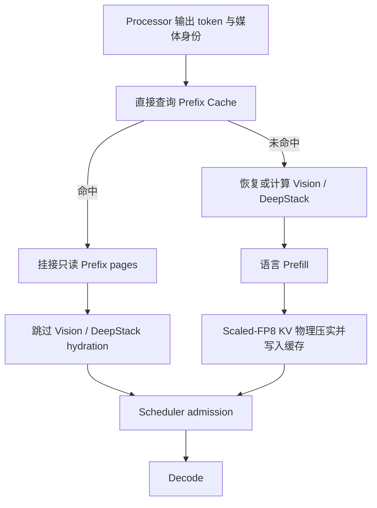

# 重复视觉上下文：设计、实现与验证

## 1. 场景与问题

目标负载是“上传一组图片后连续提出不同问题”。对这类请求，视觉内容和图片前面的公共
Prompt 不变，问题文本位于其后。

只缓存 Processor 或 Vision Encoder 输出仍不够：每个新问题都要让语言模型重新 Prefill
数百到数千个视觉 token。普通 Prefix Cache 可以复用完全相同的前缀，但长视觉前缀会快速
占满 KV Pool；当工作集超过显存预算时，前缀被淘汰后仍要重新执行 Vision 和语言 Prefill。

Prism-Infer 的处理方式是：

1. 用 media-first Prompt 构造与问题无关的公共视觉前缀；
2. 将公共前缀的 K/V 量化为 Scaled-FP8，并物理删除一部分视觉 token；
3. 把压实后的 Paged KV 作为可跨问题复用的缓存对象；
4. 让缓存借用整个空闲 KV Pool，活跃请求需要空间时再回收；
5. 用请求级记录和 Nsight Trace 同时验证容量、延迟、质量和真实执行路径。

这里没有提出新的视觉 token 选择算法。图片主路径使用 query-agnostic Uniform 作为明确的
有损 operating point；项目贡献在于量化、物理压实、页所有权、内容身份和在线请求路径的
组合实现。

## 2. Prompt 与缓存身份

同一组图片使用固定顺序和显式编号：

```text
Image 1: <image>
Image 2: <image>
...
Question: ...
```

最后一个视觉占位符之前的精确 token 序列构成公共前缀，问题和生成 token 不进入缓存。
编号保留多图之间的对应关系；质量实验单独比较了该布局与数据集官方交错布局的差异。

Prefix Cache ID 由以下内容直接计算：

```text
model / processor namespace
+ ordered media content SHA256
+ processor layout and media tensor identity
+ public prefix token count
+ exact public prefix token SHA256
```

文件输入按内容计算身份，不依赖文件路径或 Python 对象地址。Cache ID 直接进入字典查询，
平均查找复杂度为 O(1)。命中后仍比较媒体 key、公共前缀长度和完整 token 序列；摘要碰撞
不会静默复用错误 KV。

相关实现：

- `prism_infer/engine/online.py`：媒体与 Prompt 身份；
- `prism_infer/engine/sequence.py`：公共前缀边界和请求元数据；
- `prism_infer/engine/block_manager.py`：Prefix Entry、页引用和回收。

## 3. Prefix-first 请求路径

Prefix 查询发生在 Scheduler admission 和视觉缓存 hydration 之前：



如果查询和实际页分配之间发生淘汰，请求仍持有原始媒体 Tensor。分配时发现条目消失后，
请求记录一次 `stale_probe_fallbacks`，然后自然回到完整 Vision + Prefill 路径，不会失败或
使用失效页。

运行时公开三项关键计数：

- `pre_admission_hits`：调度准入前发现的 Prefix 命中；
- `visual_hydration_skips`：命中后真正跳过视觉缓存恢复的次数；
- `stale_probe_fallbacks`：早期命中但分配前条目已被回收的次数。

相关实现位于 `prism_infer/engine/llm_engine.py` 和
`prism_infer/engine/block_manager.py`。

## 4. Scaled-FP8 与物理压实

KV 格式为：

```text
K/V payload: E4M3FN
K scale:     FP32[token, kv_head]
V scale:     FP32[token, kv_head]
```

K/V 和 scale 一起经过 Store、Paged Attention、Copy-on-Write、Swap、Compaction 和 CUDA
Graph Replay。scale 开销包含在容量计算中，因此同 token capacity 的实际 KV 存储减少
48.44%，而不是简单写成 50%。

图片 Prefix Prefill 完成后，Uniform selector 生成视觉 token 保留表。运行时把保留 token
的 K/V 与 scale 移动到连续物理 slot，更新 block table 和 physical context length，再释放
空出的页。保留 token 的原始 M-RoPE logical position 不变；变化的只是 Attention 读取的
物理页位置。

```text
logical tokens:   [text][visual tokens................][suffix]
keep indices:            ^   ^  ^    ^       ^
physical KV:      [text][kept visual][suffix]
M-RoPE position:  保留原始 logical coordinates
```

图片配置为 `keep_ratio=0.6`、最少保留 768 个视觉 token。短图不会发生删除；256-token
page 粒度还会产生取整，因此容量收益必须从真实 physical pages 读取，不能直接按 40%
估算。视频 token 删除默认关闭。

物理搬移 Kernel 位于 `prism_infer/ops/kv_compaction.py`，量化 Store 与 Paged Decode 位于
`prism_infer/ops/kv_cache_store.py` 和 `prism_infer/ops/paged_decode.py`。

## 5. 页所有权与全池回收

Prefix Entry 持有只读共享页。请求命中后增加页引用；完成、取消或异常时仅释放该请求的
引用。仍被活跃请求引用的共享页不能被淘汰。

Prefix 最后一页通常未填满。若请求直接在共享尾页追加问题 token，会覆盖缓存；若每次
重新复制，又会产生重复分配和拷贝。因此请求使用私有 tail clone，完成后把可复用 clone
放回小型池。活跃请求需要页时，空闲 tail clone 是第一回收对象。

Prefix Cache 可以使用全部暂时空闲的 KV pages，不划分固定小池。分配、追加、CoW 或
Swap-in 缺页时：

1. 回收空闲 tail clones；
2. 按 `benefit_tokens × (1 + hits) / resident_pages` 选择完整 Prefix Entry；
3. 只释放没有活跃引用的 Entry；
4. 将腾出的页交给活跃请求。

该公式是简单的缓存效用启发式，不作为新的淘汰算法贡献。核心要求是让压实释放的页真正
扩大驻留工作集，同时保持请求页优先和引用安全。

## 6. 工作集设计

MuirBench 样本先按有序媒体 SHA256 分组，只保留至少包含两个不同问题的媒体组。媒体组按
内容哈希排序，不依据性能结果选样本。Dense Scaled-FP8 预运行记录每组真实 Prefix pages，
然后构造三种工作集：

| Workset | 媒体组 | 问题 | Dense pages | 与 220-page 预算关系 |
|---|---:|---:|---:|---|
| fit | 21 | 42 | 154 | 预算内 |
| knee | 28 | 56 | 224 | 刚超过预算 |
| pressure | 42 | 85 | 312 | 全部可用重复媒体组，141.8% |

每组先请求一次建立媒体工作集，随后运行 600 条 Zipf-1.0 请求。每条测量请求都切换到该
媒体组的另一个问题。Plan 保存请求到达时间、媒体组、问题 Sample ID、媒体 SHA256、
Prompt、Dense pages、模型 revision、KV 预算和生成参数。三套引擎读取同一个 Plan。

工作集生成与消费入口：

- `benchmarks/build_working_set_plan.py`；
- `benchmarks/run_working_set_matrix.py`；
- `benchmarks/working_set_workload.py`；
- `benchmarks/summarize_working_set.py`。

## 7. 结果与因果链

### 7.1 Prism 内部对照

`pressure` 工作集：

| 路径 | 驻留媒体 | Prefix 淘汰 | 重算 tokens | TTFT p50 / p99 | E2E p50 / p99 |
|---|---:|---:|---:|---:|---:|
| Vision/DeepStack Cache only | 7 | 0 | 903,982 | 677.832 / 2,698.370 ms | 1,660.992 / 4,280.080 ms |
| Dense Prefix | 27 | 96 | 188,169 | 124.994 / 695.924 ms | 403.902 / 1,112.062 ms |
| **Compact Prefix** | **40** | **15** | **75,951** | **101.692 / 497.899 ms** | **334.834 / 832.635 ms** |

Compact 路径相对其 Dense-equivalent pages 减少 29.92%，从而使驻留媒体增加 48.15%、
淘汰减少 84.38%、重算 token 减少 59.64%，最终降低 TTFT 和 E2E。`fit` 工作集已经完全
驻留，因此压实不会产生同样收益；这也是容量压力实验必须包含拐点的原因。

### 7.2 外部比较

在 `pressure` 工作集上：

| 引擎 | TTFT p50 / p99 | E2E p50 / p99 | 进程峰值 | 重算 tokens |
|---|---:|---:|---:|---:|
| **Prism Compact** | **101.692 / 497.899 ms** | 334.834 / **832.635 ms** | **24,002 MiB** | **75,951** |
| vLLM 0.25.1 | 134.719 / 709.764 ms | **325.141** / 1,026.414 ms | 24,440 MiB | 165,678 |
| SGLang 0.5.15.post1 | 305.770 / 1,165.342 ms | 523.622 / 1,909.157 ms | 26,598 MiB | 181,294 |

Prism 相对 vLLM 的 TTFT p50/p99 低 24.52%/29.85%，E2E p99 低 18.88%，但 E2E p50
慢 2.98%。`fit` 和 `knee` 上 vLLM 的 tail 与 E2E 更好，因此结论限定为固定预算下的
容量压力场景，不表述成通用引擎排名。

## 8. 质量对照

MuirBench 四种配置使用相同 85 个跨问题样本：Dense official layout、Dense media-first、
每题独立 Attention Top-k、第一题 Attention Top-k 沿用和 Uniform 沿用。压实质量只在
确实删除过视觉 token 的 49 个配对样本上计算。

- 官方交错 Dense：49/85；media-first Dense：46/85；
- actual-deletion cohort：Dense 27/49；
- Attention Top-k per question：20/49；
- first-question Attention Top-k reuse：20/49；
- query-agnostic Uniform reuse：20/49。

当前 Attention 对照没有得到优于 Uniform 的跨问题结果，但这不代表 Uniform 在算法上
优于 LOOK-M、VL-Cache、FastV 或 VisionZip。它只说明在当前模型、保留率和数据子集下，
没有找到质量更好的可复用 Attention 选择。

DocVQA 的 190 条样本均未触发 token 删除，因此相同 ANLS 不能作为无损证据。MVBench
Uniform 从 183/252 降至 113/252，支持“视频删除默认关闭”的实现选择。

## 9. 执行路径证据

代表性 Nsight Systems capture 包含一次冷请求和一次同媒体不同问题的 Prefix 命中请求。
Trace 观察到：

- 冷请求包含 Vision embedding cache miss；
- 命中请求没有 Vision 或 DeepStack range；
- 命中请求增加 `visual_hydration_skips`，没有 stale fallback；
- 275 个 prompt tokens 中有 145 个来自共享公共前缀；
- cold/hit GPU busy time 为 44.365/19.576 ms。

[`trace_audit.json`](../artifacts/working_set/trace/trace_audit.json) 保存上述路径观察，
[`prefix_hit.nsys-rep`](../artifacts/working_set/trace/prefix_hit.nsys-rep) 保存原始 capture。

## 10. 实现中解决的问题

### 查询顺序

Prefix 查询如果发生在视觉 hydration 之后，即使 KV 命中也无法省去 Vision 路径。查询被
提前到 submission/admission 之间，并以 `visual_hydration_skips` 和 Trace 确认效果。

### 查找复杂度

遍历所有 Prefix Entries 比较 token 会让控制面开销随驻留条目增长。内容摘要现在直接
构造 Cache ID，再用完整 token 做碰撞保护。

### 页池利用率

把 Prefix Cache 限制在 KV Pool 的固定小区域会使压实释放的页无法转化为更多驻留媒体。
缓存改为借用全池空闲页，并让活跃请求分配触发安全回收。

### 早查与淘汰竞态

早期 probe 后条目可能在页分配前被其他请求淘汰。请求保留原始媒体直到分配完成，失效时
回到冷路径；该路径通过 `stale_probe_fallbacks` 单独观察。

### 尾页写入

共享未满尾页继续写入会污染其他请求。只读共享页、私有 tail clone、引用计数和回收顺序
共同处理完成、取消、Swap 和异常路径。

### 工作集语义

一个较早的工作集草案只按媒体分组，没有要求每组包含多个问题，实际流量主要是完全相同
Prompt 的重复。该数据未进入当前结果。现有 Plan 强制每组至少两个问题，并记录可用问题、
实际覆盖问题和逐组问题切换次数。

### 产物版本

Dense Page 预运行与 Working-set Plan 的生命周期不同。两者使用独立 schema version，
Plan 升级不再让未变化的 Dense Page 测量失效。

## 11. 与现有系统的关系

vLLM Automatic Prefix Caching 和 SGLang RadixAttention 都能复用 token Prefix；vLLM 还
提供 Processor/Encoder Cache。Prism 的差异不是“第一次实现 Prefix Cache”，而是把经过
Scaled-FP8 量化和物理视觉 token 压实的页作为复用对象，使相同 KV 字节预算容纳更多媒体
Prefix。代价是明确的视觉质量损失。

更完整的框架实现与论文对照见[相关工作与项目边界](RELATED_WORK.md)。

## 12. 限制

- 结果限定于 Qwen3-VL-8B、RTX 5090、TP1、给定 KV 预算与重复多图提问；
- 图片 Uniform 压实存在质量损失，当前不适合默认用于所有请求；
- 视频 token 删除默认关闭；
- Prefix Cache 不跨 Engine Process 或机器共享；
- 未实现自适应质量策略、训练式 selector 或跨节点缓存一致性。
