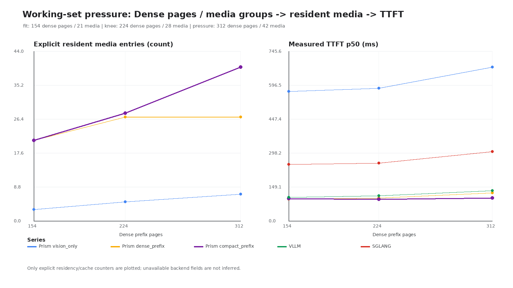

# 性能与质量结果

## 测试环境

| 项目 | 配置 |
|---|---|
| GPU | NVIDIA GeForce RTX 5090 32 GB |
| Driver / CUDA | 580.105.08 / 13.0 |
| Python | 3.12.3 |
| PyTorch | 2.11.0+cu130 |
| Transformers | 5.14.1 |
| Model | Qwen3-VL-8B-Instruct |
| Model revision | `0c351dd01ed87e9c1b53cbc748cba10e6187ff3b` |
| External engines | vLLM 0.25.1 / SGLang 0.5.15.post1 |

工作集结果、batch-1 Decode、KV 容量和 TP2 使用不同的固定协议。下面分别陈述，不把
不同协议的数字拼成一次实验。请求级记录和派生表位于
[`artifacts/working_set`](../artifacts/working_set/README.md)。

## 1. 重复视觉上下文

### 1.1 工作集与比较协议

性能工作集只包含“同一有序媒体至少对应两个不同问题”的 MuirBench 媒体组。每组先
冷建立一次前缀，随后运行 600 条 Zipf-1.0 请求；Poisson 4 req/s、greedy、output 16。
每条测量请求都切换到该媒体组的另一个问题。

| Workset | 媒体组 | 不同问题 | Dense Prefix pages | 220-page 预算占比 |
|---|---:|---:|---:|---:|
| fit | 21 | 42 | 154 | 70.0% |
| knee | 28 | 56 | 224 | 101.8% |
| pressure | 42 | 85 | 312 | 141.8% |

三套引擎使用完全相同的图片、media-first prompt、post-tokenization token IDs、请求顺序、
到达时间和生成参数。KV 字节预算固定为 4,282,122,240 bytes。Prism 使用 Scaled-FP8
Paged KV 和 256 MiB Vision Cache；vLLM 使用 FP8 KV、Automatic Prefix Caching 和
1 GiB Processor Cache；SGLang 使用 FP8 KV、Radix Cache 与 `mm_global_cache`。进程峰值
来自 NVML compute-process 采样，不用整卡 `memory.used` 代替。

### 1.2 Prism 内部对照

`pressure` 工作集：

| 路径 | 驻留媒体 | Prefix 淘汰 | Vision miss | 重算 prompt tokens | TTFT p50 / p99 | E2E p50 / p99 |
|---|---:|---:|---:|---:|---:|---:|
| Vision/DeepStack Cache only | 7 | 0 | 375 | 903,982 | 677.832 / 2,698.370 ms | 1,660.992 / 4,280.080 ms |
| Dense Scaled-FP8 Prefix | 27 | 96 | 71 | 188,169 | 124.994 / 695.924 ms | 403.902 / 1,112.062 ms |
| **Compact Scaled-FP8 Prefix** | **40** | **15** | **4** | **75,951** | **101.692 / 497.899 ms** | **334.834 / 832.635 ms** |

Compact 路径累计处理 3,941 个 Dense-equivalent Prefix pages，实际保留 2,762 pages，
减少 29.92%。相对 Dense Prefix，驻留媒体增加 48.15%，淘汰减少 84.38%，重算 token
减少 59.64%；TTFT p50/p99 分别降低 18.64%/28.46%，E2E p50/p99 分别降低
17.10%/25.13%。这条链路说明收益来自“页减少 → 驻留增加 → 淘汰和重算减少”，而不是
一次偶然的 Decode 波动。

### 1.3 Prism、vLLM 与 SGLang

表中 Prism 使用 Compact Prefix。延迟单位为毫秒：

| Workset | 引擎 | TTFT p50 / p99 | E2E p50 / p99 | 进程峰值 | 重算 prompt tokens |
|---|---|---:|---:|---:|---:|
| fit | Prism | **98.923** / 445.645 | 329.764 / 771.089 | **24,002 MiB** | 70,206 |
| fit | vLLM | 105.237 / **224.541** | **287.106 / 445.438** | 24,212 MiB | **34,234** |
| fit | SGLang | 249.515 / 713.390 | 460.995 / 1,191.603 | 25,110 MiB | 34,234 |
| knee | Prism | **96.449** / 581.247 | 327.460 / 867.021 | **24,002 MiB** | 69,779 |
| knee | vLLM | 111.677 / **310.884** | **294.012 / 574.876** | 24,212 MiB | **51,194** |
| knee | SGLang | 255.155 / 894.247 | 472.975 / 1,240.037 | 25,688 MiB | 75,514 |
| pressure | **Prism** | **101.692 / 497.899** | 334.834 / **832.635** | **24,002 MiB** | **75,951** |
| pressure | vLLM | 134.719 / 709.764 | **325.141** / 1,026.414 | 24,440 MiB | 165,678 |
| pressure | SGLang | 305.770 / 1,165.342 | 523.622 / 1,909.157 | 26,598 MiB | 181,294 |

`fit` 和 `knee` 上，Prism 的 TTFT p50 较低，但 vLLM 的 tail latency 与 E2E 更好；此时
额外的缓存容量没有转化为端到端优势。`pressure` 超过 KV 容量后，Prism 相对 vLLM 的
TTFT p50/p99 分别低 24.52%/29.85%，E2E p99 低 18.88%，重算 token 少 54.16%，
进程峰值低 438 MiB；E2E p50 仍慢 2.98%。

三套引擎的输出吞吐为 64.16–64.26 tok/s，主要由固定到达率和 output 16 决定，不作为
吞吐领先证据。vLLM/SGLang 不公开与 Prism 完全同义的 resident-entry 和 eviction
计数，因此这些字段标为 unavailable，不从间接指标推算。

### 1.4 质量取舍

| Dataset / cohort | Dense reference | Compact result | 结论 |
|---|---:|---:|---|
| MuirBench，85 条布局对照 | 官方交错 49/85 | labeled media-first 46/85 | Prompt 重排损失 3 题 |
| MuirBench，49 条实际删除样本 | labeled Dense 27/49 | Uniform 20/49 | 净损失 7 题；两种 Attention 对照也为 20/49 |
| DocVQA，190 条 | ANLS 0.93335 | ANLS 0.93335 | 0 条发生删除，不能证明压实无损 |
| MVBench，252 条 | 183/252 | 113/252 | 视频删除质量下降，默认关闭 |

Uniform 是 query-agnostic 的跨问题复用对照，不是新的 token selection 算法。当前结果是
明确的有损 operating point，也不是与 vLLM/SGLang 等质量的通用排名。完整配对结果见
[`working_set_quality.md`](../artifacts/working_set/quality/working_set_quality.md)。

### 1.5 Prefix-hit Trace

代表性 Nsight Systems capture 分别包含冷请求和同媒体不同问题的 Prefix 命中请求：

- 冷请求出现一次 `prism::model.vision.embedding_cache_miss`；
- Prefix-hit range 没有 Vision/DeepStack range；
- `visual_hydration_skips` 增加 1，`stale_probe_fallbacks` 为 0；
- 命中请求复用 145/275 个 prompt tokens；
- cold/hit GPU busy time 为 44.365/19.576 ms。

Trace 用于确认执行路径，不替代上面的非 profiler 延迟测量。机器可读观察项位于
[`trace_audit.json`](../artifacts/working_set/trace/trace_audit.json)。

## 2. TP1 Decode

协议：batch 1、greedy、output 128、warmup 2、repeat 5；三套引擎使用相同的
Qwen3-VL prompt tokens。

| 场景 | 引擎 | TPOT | TTFT | E2E |
|---|---|---:|---:|---:|
| 8 张 448×448 图片 | **Prism** | **9.8821 ms** | **245.349 ms** | **1,598.843 ms** |
| | SGLang | 10.3520 ms | 284.844 ms | 1,600.005 ms |
| | vLLM | 10.5276 ms | 290.574 ms | 1,628.751 ms |
| 16 帧 448×448 视频 | **Prism** | **9.8680 ms** | **240.175 ms** | **1,601.801 ms** |
| | SGLang | 10.3689 ms | 390.149 ms | 1,707.185 ms |
| | vLLM | 10.5278 ms | 323.819 ms | 1,673.800 ms |

Prism TPOT 比 SGLang 低 4.54%–4.83%，比 vLLM 低 6.13%–6.27%。该结果只覆盖 RTX
5090、TP1、batch 1 的固定 Decode 路径，不代表高并发吞吐排名。

## 3. KV Cache 容量

| 配置 | Pages / capacity | KV bytes | NVML peak | Torch peak |
|---|---:|---:|---:|---:|
| BF16 | 113 / 28,928 tokens | 4,068.000 MiB | 23,938 MiB | 21,637.368 MiB |
| Scaled-FP8，同容量 | 113 / 28,928 tokens | 2,097.562 MiB | 21,966 MiB | 19,667.298 MiB |
| Scaled-FP8，约 4 GiB | 220 / 56,320 tokens | 4,083.750 MiB | 23,952 MiB | 21,653.298 MiB |

Scaled-FP8 在同 token capacity 下将 KV 存储减少 48.44%，进程显存峰值减少 1,972 MiB
（8.24%）；相同约 4 GiB KV 预算下，capacity 从 28,928 增至 56,320 tokens
（+94.69%）。K/V 使用 E4M3FN payload 和 per-token、per-KV-head FP32 scale；scale
开销包含在上述容量中。

## 4. 双卡 TP2

协议：单张 448×448 图片、210 prompt tokens、batch 1、greedy、output 32、warmup 1、
repeat 3、`max_model_len=512`。

| 引擎 | TPOT | TTFT | E2E | 输出关系 |
|---|---:|---:|---:|---|
| **Prism** | **5.9701 ms** | 86.057 ms | 281.098 ms | 与 vLLM 的 32 个 token 相同 |
| vLLM | 6.1612 ms | 61.251 ms | 252.744 ms | 参考输出 |
| SGLang | 5.9701 ms | 45.452 ms | 230.601 ms | 从第 21 个 token 起不同 |

Prism TPOT 比 vLLM 低 3.10%，但 TTFT/E2E 更慢。Vision Encoder 仍在两个 rank 上重复
执行，测量主机也没有直接 GPU P2P/NVLink。Nsight 归因中 cuBLAS BF16 GEMV 约占 84%
GPU 时间，NCCL AllReduce 约 8%，Paged Attention 约 2.6%；结论是语言 Decode 切分
有效，但多模态端到端仍受复制 Vision 路径限制。

## 5. 适用范围

- 主工作集结果只覆盖 Qwen3-VL-8B、RTX 5090、TP1、固定 KV 字节预算和重复多图提问；
- 图片压实存在明确质量损失，视频删除默认关闭；
- Prefix Cache 位于单个 Engine Process 内，不跨进程或机器共享；
- Vision Parallel、PP、MoE Expert Parallel 和多机推理尚未实现；
- Serving API 为项目自有格式，不兼容 OpenAI API。
